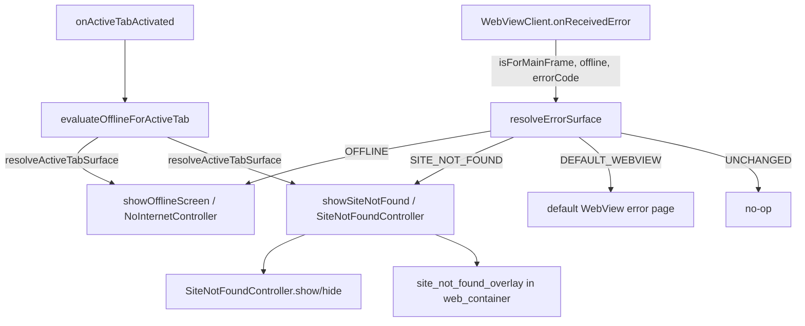

# Design Document

## Overview

This feature adds two changes to the EffectiveBrowser Android app (`me.thimmaiah.ebors`, `MainActivity`):

1. **Custom "site not found" screen.** When the device is online but a main-frame navigation fails because the host cannot be resolved (`WebViewClient.ERROR_HOST_LOOKUP`), the app shows a branded, animated in-app overlay instead of falling through to the default WebView error page. The screen is adapted from the provided `handoff/` assets, with the struck-through host pill and the "Search for ..." button removed per explicit user direction.

2. **Scanner orientation lock.** The QR/barcode scanner currently passes `setOrientationLocked(false)`, allowing the capture UI to auto-rotate. This is changed to `setOrientationLocked(true)` so the capture view stays in a fixed orientation.

The site-not-found screen deliberately mirrors the existing offline-screen architecture: an overlay included inside `web_container`, toggled by visibility against the active WebView, driven by a thin controller that owns only the hero animation. The error-routing decision is added to the existing `WebViewClient.onReceivedError` callback with a strict precedence (offline first, then host-lookup failure, then default behavior).

### Goals

- Route online host-lookup failures to the custom screen while preserving all existing offline behavior.
- Keep the site-not-found overlay consistent across tab switches and successful reloads (no stale overlay).
- Lock the scanner orientation without changing the decode-result routing.

### Non-Goals

- No change to the no-internet (offline) screen behavior or assets.
- No handling of non-host-lookup error codes (`ERROR_CONNECT`, `ERROR_TIMEOUT`, etc.) — those keep the default WebView error page.
- No change to how decoded scanner values are resolved (`resolveUserInput` → `navigationController.loadAddress`).

## Architecture

### Existing offline pattern (the template we follow)

The offline screen is built from these collaborating pieces, all of which have a direct analogue in this feature:

| Concern | Offline implementation | Site-not-found analogue |
|---|---|---|
| Overlay layout | `@id/no_internet_overlay` `<include>` in `activity_main.xml` (sibling of `web_host`, `visibility=gone`) | new `@id/site_not_found_overlay` `<include>` of `activity_site_not_found` |
| Animation controller | `NoInternetController` (hero start/stop + refresh spin) | new `SiteNotFoundController` (hero start/stop only) |
| Show / hide | `showOfflineScreen()` / `hideOfflineScreen()` toggle overlay visibility and WebView visibility | new `showSiteNotFound(url)` / `hideSiteNotFound()` |
| Per-tab state | `Tab.mainFrameErrored: Boolean` | new `Tab.siteNotFoundUrl: String?` (the unresolved failing URL, or null) |
| Tab-switch restore | `evaluateOfflineForActiveTab()` | folded into the same evaluation so precedence is enforced in one place |
| Routing trigger | `onReceivedError` → `if (isDeviceOffline()) showOfflineScreen()` | `onReceivedError` → precedence `when` block |

### Routing decision (precedence)

The core of Requirement 1 is the ordering inside `onReceivedError`. The decision is extracted into a **pure function** so it can be property-tested independently of the WebView/UI:

```kotlin
enum class ErrorSurface { UNCHANGED, OFFLINE, SITE_NOT_FOUND, DEFAULT_WEBVIEW }

fun resolveErrorSurface(
    isForMainFrame: Boolean,
    isDeviceOffline: Boolean,
    errorCode: Int,
): ErrorSurface = when {
    !isForMainFrame -> ErrorSurface.UNCHANGED
    isDeviceOffline -> ErrorSurface.OFFLINE
    errorCode == WebViewClient.ERROR_HOST_LOOKUP -> ErrorSurface.SITE_NOT_FOUND
    else -> ErrorSurface.DEFAULT_WEBVIEW
}
```

`onReceivedError` calls this and dispatches:

- `UNCHANGED` → return without touching tab presentation (sub-resource failure).
- `OFFLINE` → existing `showOfflineScreen()` path (unchanged), set `tab.mainFrameErrored = true`.
- `SITE_NOT_FOUND` → set `tab.mainFrameErrored = true`, record `tab.siteNotFoundUrl = failingUrl`, and if `tab === activeTabOrNull` call `showSiteNotFound(failingUrl)`.
- `DEFAULT_WEBVIEW` → set `tab.mainFrameErrored = true` only (current behavior — WebView shows its own error page).

Offline precedence (Requirement 1.2, 4.4, 6.x) is structurally guaranteed because the `isDeviceOffline` branch is evaluated before the host-lookup branch.

### Tab-switch / restore evaluation

`evaluateOfflineForActiveTab()` is the single place that re-decides which surface belongs over the now-active tab on every tab switch (called from `onActiveTabActivated`). It is extended to also resolve the site-not-found surface, using the same precedence. The decision is again extracted into a pure function:

```kotlin
enum class ActiveSurface { NONE, OFFLINE, SITE_NOT_FOUND }

fun resolveActiveTabSurface(
    hasMainFrameError: Boolean,
    hasUnresolvedHostLookup: Boolean,
    isDeviceOffline: Boolean,
): ActiveSurface = when {
    isDeviceOffline && hasMainFrameError -> ActiveSurface.OFFLINE
    hasUnresolvedHostLookup -> ActiveSurface.SITE_NOT_FOUND
    else -> ActiveSurface.NONE
}
```

`evaluateOfflineForActiveTab()` maps the result onto the existing show/hide calls (and the online-recovery reload that already happens for `mainFrameErrored` tabs). When the result is `SITE_NOT_FOUND`, it shows the site-not-found overlay for `tab.siteNotFoundUrl`; otherwise it hides it. This keeps offline precedence (4.4) and "hide on a tab without the error" (4.3) in one tested function.

### Scanner

The ZXing library's bundled `com.journeyapps.barcodescanner.CaptureActivity` is declared `android:screenOrientation="sensorLandscape"` in its manifest, so the capture screen always opens in landscape. `ScanOptions.setOrientationLocked(true)` does **not** fix this — that flag only makes `CaptureManager` re-lock to whatever orientation the activity *started* in (landscape), so it cannot force portrait.

The fix is a dedicated portrait capture activity:
- `PortraitCaptureActivity` — a trivial subclass of `com.journeyapps.barcodescanner.CaptureActivity` with no added behavior.
- It is declared in the app manifest with `android:screenOrientation="portrait"` (plus the library's `@style/zxing_CaptureTheme`, `stateNotNeeded`, `clearTaskOnLaunch`, and `exported="false"`). Android's WindowManager enforces this manifest orientation regardless of the library's `CaptureManager`.
- `launchQrScanner()` calls `setCaptureActivity(PortraitCaptureActivity::class.java)` and `setOrientationLocked(false)`. Orientation lock must be **false** so `CaptureManager` does not override the manifest portrait orientation by re-locking to the device's current rotation.

The decode result path (`qrScanLauncher` → `resolveUserInput` → `navigationController.loadAddress`) is unchanged, so URL-vs-search routing and the cancel/empty no-op all remain as-is.

### Component diagram



### Error-routing sequence

```mermaid
sequenceDiagram
    participant WV as WebView
    participant MA as MainActivity.onReceivedError
    participant R as resolveErrorSurface
    participant T as Tab
    participant UI as Overlays

    WV->>MA: onReceivedError(request, error)
    MA->>R: resolveErrorSurface(isForMainFrame, isDeviceOffline, errorCode)
    alt UNCHANGED (sub-resource)
        R-->>MA: UNCHANGED
        MA-->>WV: return (no change)
    else OFFLINE
        R-->>MA: OFFLINE
        MA->>T: mainFrameErrored = true
        MA->>UI: showOfflineScreen()
    else SITE_NOT_FOUND
        R-->>MA: SITE_NOT_FOUND
        MA->>T: mainFrameErrored = true; siteNotFoundUrl = failingUrl
        MA->>UI: showSiteNotFound(failingUrl) [if active tab]
    else DEFAULT_WEBVIEW
        R-->>MA: DEFAULT_WEBVIEW
        MA->>T: mainFrameErrored = true
        MA-->>WV: leave default error page
    end
```

## Components and Interfaces

### `SiteNotFoundController` (new)

Adapted from `handoff/SiteNotFoundActivity.patch.kt`, modeled on `NoInternetController`. **Two removals from the handoff version:**

- Remove the `site_not_found_tab_url` field and its `Paint.STRIKE_THRU_TEXT_FLAG` binding (the host pill row is removed from the layout).
- Remove the `site_not_found_search` field, its `onSearch` parameter, and its click wiring (the search button is removed from the layout).

Resulting interface:

```kotlin
class SiteNotFoundController(activity: AppCompatActivity) {
    private val hero: ImageView = activity.findViewById(R.id.site_not_found_hero)
    private val body: TextView = activity.findViewById(R.id.site_not_found_body)
    private val backBtn: Button = activity.findViewById(R.id.site_not_found_back)
    private val retryBtn: Button = activity.findViewById(R.id.site_not_found_retry)

    /** Bind body copy + CTAs and start the hero animation. */
    fun show(failedUrl: String, onBack: () -> Unit, onRetry: () -> Unit) {
        val host = Uri.parse(failedUrl).host ?: failedUrl
        body.text = activity.getString(R.string.site_not_found_body, host)
        backBtn.setOnClickListener { onBack() }
        retryBtn.setOnClickListener { onRetry() }
        startAnimations()
    }

    fun startAnimations() { (hero.drawable as? Animatable)?.start() }
    fun stopAnimations() { (hero.drawable as? Animatable)?.stop() }
}
```

The controller owns only the hero `Animatable` (start on show, stop on hide / background), matching how `NoInternetController` stops animations in `onPause`/`onStop` and restarts in `onResume`.

### `MainActivity` additions

- `siteNotFoundController: SiteNotFoundController by lazy { ... }` — lazily constructed after the overlay include is in the tree (mirrors `noInternetController`).
- `siteNotFoundShowing: Boolean` — guards idempotent hide (mirrors `offlineShowing`).
- `showSiteNotFound(url: String)`: hides start page / find bar, sets `site_not_found_overlay` visible, sets the active WebView non-visible, sets `siteNotFoundShowing = true`, calls `controller.show(url, onBack = ..., onRetry = ...)`.
  - `onRetry`: `hideSiteNotFound()`, restore WebView visibility, `activeTabOrNull?.webView?.reload()`.
  - `onBack`: `hideSiteNotFound()`, restore WebView visibility, then `if (webView.canGoBack()) webView.goBack() else showStartPage()`.
- `hideSiteNotFound()`: early-return if not showing; clears overlay visibility, restores WebView visibility, `controller.stopAnimations()`.
- `onReceivedError`: replace the single `if (isDeviceOffline())` check with the precedence dispatch on `resolveErrorSurface(...)`.
- `onPageFinished`: alongside the existing `if (!tab.mainFrameErrored) hideOfflineScreen()`, clear `tab.siteNotFoundUrl = null` and `hideSiteNotFound()` on a successful finish for the active tab (Requirement 3.4, 4.1).
- `evaluateOfflineForActiveTab()`: extend to dispatch on `resolveActiveTabSurface(...)` so it also shows/hides the site-not-found overlay on tab switch.
- `onResume`/`onPause`/`onStop`: stop/start the site-not-found hero animation when `siteNotFoundShowing`, mirroring the offline controller lifecycle hooks.

### `ErrorSurface` / `resolveErrorSurface` and `ActiveSurface` / `resolveActiveTabSurface` (new pure functions)

Extracted decision logic (see Architecture). These hold no Android dependencies beyond the `WebViewClient.ERROR_HOST_LOOKUP` integer constant and are the primary property-test targets. They live in a small top-level file (e.g., `ErrorSurfaceRouting.kt`) so they are unit/property testable without instrumentation.

### `launchQrScanner()` + `PortraitCaptureActivity` (modified / new)

The ZXing library's `CaptureActivity` is declared `sensorLandscape` in its manifest, so `setOrientationLocked(true)` cannot force portrait. Instead: add `PortraitCaptureActivity` (a `CaptureActivity` subclass) declared `android:screenOrientation="portrait"` in the manifest, and have `launchQrScanner()` call `setCaptureActivity(PortraitCaptureActivity::class.java)` with `setOrientationLocked(false)`.

### Resources

- **Layout:** add `app/src/main/res/layout/activity_site_not_found.xml` adapted from the handoff layout, **removing** the tab pill `LinearLayout` (containing `site_not_found_tab_url`, the favicon `ImageView`, and `site_not_found_close`) and the `site_not_found_search` `Button`. Keep root, hero, eyebrow, title, body, and the back/retry row.
- **activity_main.xml:** add a `<include android:id="@+id/site_not_found_overlay" layout="@layout/activity_site_not_found" ... android:visibility="gone" />` as a sibling of `no_internet_overlay` inside the same parent under `web_container`.
- **Drawables:** copy from `handoff/res/drawable`: `avd_site_not_found_hero.xml`, `ill_site_not_found_hero.xml`, `bg_site_not_found_secondary.xml`, `bg_site_not_found_favicon.xml`. Reuses `bg_no_internet_tab_pill.xml` and `ic_no_internet_globe.xml` (already shipped with the no-internet work — verify present; the pill/globe are only needed if any retained view references them, otherwise they can be dropped from the copy list).
- **Strings:** merge from `handoff/strings.site_not_found.xml` into `app/src/main/res/values/strings.xml`: `site_not_found_eyebrow`, `site_not_found_title`, `site_not_found_body`, `site_not_found_back`, `site_not_found_retry`. **Exclude** `site_not_found_search` (the dropped button).

## Data Models

### `Tab` (extended)

```kotlin
// existing
var mainFrameErrored: Boolean = false

// new: the unresolved host-lookup failing URL for this tab, or null.
// Set when resolveErrorSurface returns SITE_NOT_FOUND for this tab;
// cleared on onPageStarted and on a successful onPageFinished.
var siteNotFoundUrl: String? = null
```

`siteNotFoundUrl != null` is the per-tab predicate "this tab has an unresolved host-lookup failure" used by `resolveActiveTabSurface`. It is cleared in `onPageStarted` (a new attempt begins) and on successful `onPageFinished`, exactly mirroring how `mainFrameErrored` is managed.

### `ErrorSurface` (new enum)

`UNCHANGED | OFFLINE | SITE_NOT_FOUND | DEFAULT_WEBVIEW` — the outcome of the `onReceivedError` routing decision.

### `ActiveSurface` (new enum)

`NONE | OFFLINE | SITE_NOT_FOUND` — the surface that belongs over the active tab after a tab switch / restore evaluation.

## Correctness Properties

*A property is a characteristic or behavior that should hold true across all valid executions of a system — essentially, a formal statement about what the system should do. Properties serve as the bridge between human-readable specifications and machine-verifiable correctness guarantees.*

The two pure routing functions — `resolveErrorSurface(isForMainFrame, isDeviceOffline, errorCode)` and `resolveActiveTabSurface(hasMainFrameError, hasUnresolvedHostLookup, isDeviceOffline)` — are the primary property-test targets. They carry no Android UI dependencies (only the integer constant `WebViewClient.ERROR_HOST_LOOKUP`), so their full input space can be exercised cheaply. The four `resolveErrorSurface` branches are mutually exclusive; each property below validates one distinct branch, and together they fully characterize the function. The `resolveActiveTabSurface` properties capture offline precedence and the positive/negative classification of the site-not-found surface.

### Property 1: Non-main-frame errors leave the tab unchanged

*For any* `isDeviceOffline` value and *any* `errorCode`, when `isForMainFrame` is `false`, `resolveErrorSurface` SHALL return `UNCHANGED`.

**Validates: Requirements 1.3**

### Property 2: Offline takes precedence over host-lookup

*For any* `errorCode` (including `ERROR_HOST_LOOKUP`), when `isForMainFrame` is `true` and `isDeviceOffline` is `true`, `resolveErrorSurface` SHALL return `OFFLINE` and SHALL never return `SITE_NOT_FOUND`.

**Validates: Requirements 1.2, 4.4, 6.1**

### Property 3: Online main-frame host-lookup failures route to site-not-found

*For any* input where `isForMainFrame` is `true`, `isDeviceOffline` is `false`, and `errorCode` equals `WebViewClient.ERROR_HOST_LOOKUP`, `resolveErrorSurface` SHALL return `SITE_NOT_FOUND`.

**Validates: Requirements 1.1**

### Property 4: Other online main-frame errors keep the default WebView behavior

*For any* `errorCode` that is not `WebViewClient.ERROR_HOST_LOOKUP`, when `isForMainFrame` is `true` and `isDeviceOffline` is `false`, `resolveErrorSurface` SHALL return `DEFAULT_WEBVIEW`.

**Validates: Requirements 1.4**

### Property 5: Active-tab offline precedence

*For any* `hasUnresolvedHostLookup` value, when `isDeviceOffline` is `true` and `hasMainFrameError` is `true`, `resolveActiveTabSurface` SHALL return `OFFLINE` and SHALL never return `SITE_NOT_FOUND`.

**Validates: Requirements 4.4, 6.1**

### Property 6: Active-tab site-not-found classification

*For any* boolean combination of `(hasMainFrameError, hasUnresolvedHostLookup, isDeviceOffline)`, `resolveActiveTabSurface` SHALL return `SITE_NOT_FOUND` if and only if `hasUnresolvedHostLookup` is `true` and `isDeviceOffline` is `false`; otherwise (and when no error applies) it SHALL return `NONE` unless the offline-precedence case (Property 5) applies.

**Validates: Requirements 4.2, 4.3**

## Error Handling

- **Null or blank failing URL.** `SiteNotFoundController.show(failedUrl, ...)` derives the displayed host via `Uri.parse(failedUrl).host ?: failedUrl`. When `failedUrl` is blank or has no parseable host, the fallback uses the raw string rather than crashing, so the body copy is always populated (supports Requirement 2.2).
- **Hero animation cast.** The hero drawable is started/stopped through `(hero.drawable as? Animatable)?.start()` / `?.stop()`. The safe cast (`as?`) means that if the drawable is not an `Animatable` (e.g., a static fallback at runtime), the start/stop calls become no-ops instead of throwing `ClassCastException` (supports Requirements 2.6, 2.7).
- **Overlay requested for a non-active tab.** `onReceivedError` only calls `showSiteNotFound(...)` when the erroring tab is the active tab; for a background tab it records `tab.siteNotFoundUrl` and `tab.mainFrameErrored` without touching the UI. The deferred surface is reconciled on tab switch by `evaluateOfflineForActiveTab()` via `resolveActiveTabSurface`, so a background failure can never paint over the wrong tab (supports Requirements 1.6, 4.2).
- **Scanner launch failure.** The existing `try/catch` around the scanner launch in `launchQrScanner()` is preserved; on an exception it surfaces the existing toast and leaves the active tab unchanged. The orientation-lock change does not alter this path (supports Requirement 5.5).
- **Idempotent hide.** `hideSiteNotFound()` early-returns when `siteNotFoundShowing` is `false`, so repeated hides (e.g., a successful `onPageFinished` followed by a tab switch) are safe and do not double-toggle WebView visibility or stop an already-stopped animation.

## Testing Strategy

### Property-based tests (primary)

The two pure routing functions are the main testable surface and are covered by property-based tests using a Kotlin/JVM property-testing library (e.g., Kotest's property module or jqwik). These run as plain JVM unit tests (no instrumentation) since the functions have no Android dependencies beyond the `ERROR_HOST_LOOKUP` integer.

- Each property test runs a minimum of **100 iterations**.
- Generators: `isForMainFrame`, `isDeviceOffline`, `hasMainFrameError`, `hasUnresolvedHostLookup` as arbitrary booleans; `errorCode` as arbitrary integers, with dedicated generation that includes `WebViewClient.ERROR_HOST_LOOKUP` and a spread of other WebView error codes (`ERROR_CONNECT`, `ERROR_TIMEOUT`, etc.) so both the host-lookup and non-host-lookup branches are exercised.
- Each test is tagged with a comment referencing its design property, using the format **Feature: site-not-found-and-scanner-ui, Property {number}: {property_text}**.
- Mapping: Property 1 → resolveErrorSurface non-main-frame; Property 2 → resolveErrorSurface offline precedence; Property 3 → resolveErrorSurface host-lookup; Property 4 → resolveErrorSurface default; Property 5 → resolveActiveTabSurface offline precedence; Property 6 → resolveActiveTabSurface classification.

### Unit-level coverage (examples and edge cases)

- **`SiteNotFoundController` binding:** verify `show(...)` populates the body copy via `getString(R.string.site_not_found_body, host)`, wires the back/retry click listeners to the supplied lambdas, and starts the hero animation; verify host fallback for a null/blank/host-less URL (edge case for Requirement 2.2).
- **`onReceivedError` dispatch:** example tests that each `ErrorSurface` outcome sets the expected `Tab` state (`mainFrameErrored`, `siteNotFoundUrl`) and calls the correct show path only for the active tab (Requirements 1.5, 1.6).
- **Recovery handlers:** `onRetry` reloads the failing URL and restores WebView visibility (3.1); `onBack` navigates back or shows the start page based on `canGoBack()` (3.2, 3.3); successful `onPageFinished` clears `siteNotFoundUrl` and hides the overlay (3.4, 4.1).
- **Scanner option change:** assert that `launchQrScanner()` builds `ScanOptions` with orientation locked (`setOrientationLocked(true)`) (Requirement 5.1, smoke-level).

### Manual on-device verification

The device is connected, so the following — which depend on Android view rendering, animation, and the ZXing capture activity — are verified manually (via logcat and on-screen observation) rather than by automated tests:

- The animated site-not-found overlay renders the hero, eyebrow, title, and body, hides the WebView while shown, and starts/stops the hero animation on show/hide and on lifecycle pause/resume (Requirements 2.1, 2.5, 2.6, 2.7).
- The scanner capture UI stays in portrait while rotating the device during a scan (Requirement 5.2), and decoded values still route to URL-load vs. search as before (Requirements 5.3, 5.4).
